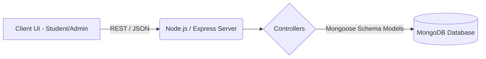

# 1. Title Page
- **Project Title:** HosteX - Modern Hostel Management System
- **Team Name:** Z-coders
- **Team Members:**
  - Veer Singh (Team Leader)
  - Mandeep
  - Shamsher Singh
  - Hitanshu
  - Vishal
- **Institution/Organization:** [Organization Name]
- **Date of Submission:** [Date]

---

## 2. Abstract
HosteX is an all-in-one digital solution designed to streamline hostel administration and improve the quality of life for residents. The system modernizes traditional, paper-based hostel management by centralizing workflows such as visitor tracking, leave management, student entries, maintenance complaints, and parcel handling. By providing a secure, centralized API backend architecture with role-based access, HosteX increases administrative transparency while offering students a seamless platform to raise requests and track everyday campus logistics.

---

## 3. Problem Statement
Hostel administration across institutions heavily relies on manual registers and fragmented communication methods. This presents several challenges:
- **Inefficiency:** Tracking student leaves, visitors, and parcels via paper ledgers is slow, error-prone, and makes data retrieval difficult.
- **Delayed Maintenance:** Complaints regarding electrical, plumbing, or room issues often get lost, leading to poor living conditions and frustrated responses from students.
- **Security Risks:** Without real-time updates on student entry/exits and authorized visitor logging, maintaining security on the premises becomes a significant administrative challenge.

---

## 4. Objectives
1. **Digitize Core End-to-End Operations:** Fully digitalize visitor logging, leave approvals, and student check-ins/check-outs to replace manual ledger tracking.
2. **Improve Request Turnaround Times:** Centralize the maintenance complaint pipeline and parcel tracking mechanisms to boost accountability and reduce delays.
3. **Enhance Security and Administrative Control:** Provide robust role-based access (e.g., student, admin, and warden) for precise, real-time monitoring of hostel premises and data governance.

---

## 5. Proposed Solution
Overview of the system:
HosteX is a robust web-based architecture composed of a scalable Node.js backend linked with a responsive user frontend. 

- **Key idea and approach:** Instead of using standalone apps for different processes, HosteX groups distinct hostel workflows—entries, leave approvals, visitor monitoring, automated parcel handling, and grievance pipelines—into unified administrative and student portals.
- **Innovation or uniqueness:** The platform features dynamic dashboard analytics for hostel wardens, offering a bird's-eye view of hostel telemetry along with immediate actionable alerts. It features comprehensive REST APIs specifically tailored to campus housing use-cases.

---

## 6. System Architecture
**High-level architecture description:**
The system uses a highly decoupled Client-Server model. The backend acts as a gateway and business logic handler that receives and processes JSON payloads securely.

- **Description of components and their interactions:**
  - **Client/Frontend:** Renders user-specific dashboards depending on whether the user is a student or warden.
  - **Express Server (Backend):** Separates logic into controllers, middlewares, and routes. It authenticates users via token mechanisms before querying the database.
  - **Database Cluster:** Stores normalized domain entities like `User`, `Leave`, `Complaint`, `Entry`, and `Visitor`.
- **Data flow:**
  The student raises a request (e.g., Leave application) via the frontend. The payload routes to the backend's `/leave` endpoint, undergoes verification using authentication middlewares, is pushed to MongoDB, and eventually displays as 'Pending' on the Admin's dashboard queue.

---

## 7. Technology Stack
- **Frontend:** React.js / Next.js (Modern Web UI Framework)
- **Backend:** Node.js, Express.js
- **Database:** MongoDB (utilizing Mongoose ODM for Schemas)
- **APIs/Integrations:** REST APIs via JSON Architecture
- **Other Tools/Frameworks:** Postman (API Testing), Git/GitHub (Version Control)

---

## 8. Methodology and Implementation
- **Workflow/Process:**
  1. **Requirement Analysis:** Identifying the data attributes for students, wardens, leaves, and entries based on real-world hostel operations.
  2. **Schema Design:** Crafting strict NoSQL schemas (`User.js`, `leaveSchema.js`, `visitorSchema.js`) to ensure data validations securely at the application layer.
  3. **Backend Logic & Routing:** Integrating explicit decoupled controllers (`dashboard.controller.js`, `parcel.controller.js`) combined by the Express routers.
  4. **Security Checkpoints:** Ensuring protected routes so regular students cannot modify other students' access rules.
- **Algorithms or models used:** Role-based Authorization Model (RBAC) and data-encryption models for user sessions.
- **Data handling:** Data is routed utilizing optimized JSON transactions containing status fields (e.g., `Approved`, `Pending`) for robust state management.

---

## 10. Use Cases and Challenges Resolution
- **Target users:** 
  - *Students / Residents* (requesting leaves, filing complaints, logging parcels).
  - *Hostel Admin / Warden* (approving requests, resolving complaints, reviewing dashboards).
  - *Security Personnel* (validating visitors matching records in system).
- **Real-world scenarios applied:**
  - A student receives a package while attending classes. The admin logs the parcel using the parcel workflow, and the system automatically notifies the student securely.
  - Parents visiting their wards log into the online secure boundary system to leave robust digital trails, eliminating spoofed manual signatures.

---

## 11. Future Scope
- **Additional features:** Integration with QR codes or biometric scanners to completely automate student entry/exit tracking.
- **Scalability improvements:** Migration to microservices architecture to process multiple hostels in a university system concurrently.
- **Long-term vision:** Integrating HosteX with the larger university fee management and academic portals to behave as the complete housing-student lifecycle ecosystem.

---

## 12. Conclusion
- **Key achievements:** We have successfully built the foundation and backend capabilities required to replace outmoded paper-heavy hostel functions.
- **Overall impact:** HosteX improves response times, holds the management accountable via distinct trails of complaints/parcels, and provides comprehensive visibility of hostel processes.
- **Final remarks:** Project HosteX underlines the ease with which technology can declutter administrative burdens, proving to be an indispensable upgrade for any housing management facility.

---

## 13. References
- Official Node.js & Express Documentation
- MongoDB Mongoose Documentation
- HosteX SCH_Documentation provided requirements guidelines.
